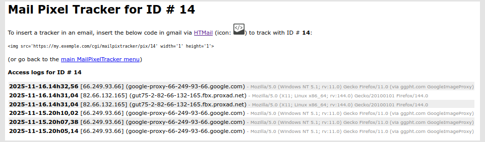

# Mail Pix Tracker

This is a simple bash script to track emails via an invisible pixel, for my personal use.

- No dependency. Just a single shell script
- Only need any web server able to execute [CGI](https://en.wikipedia.org/wiki/Common_Gateway_Interface) scripts
- It displays some html code to include in your emails. For GMail, you can use the HTMail extension for [Firefox](https://addons.mozilla.org/en-US/firefox/addon/htmail/) or [Chrome](https://chromewebstore.google.com/detail/htmail-insert-html-into-g/omojcahabhafmagldeheegggbakefhlh?hl=en).

Note that the tracking is not foolproof. Most mailers nowadays prompt the user before loading images.

## Installation

- Just copy mailpixtracker into any cgi-enabled directory on your web server
- You can rename it as you want, let's say "my-mpt". Since there are no access control, choosing a hard to guess name will act as a protection, or you can protect the access via directives of your web server.
- Requirements: 
  - bash at least version 4 (see $BASH_VERSION). V4 was released in 2010.
  - [tac](https://man7.org/linux/man-pages/man1/tac.1.html)
  - [base64](https://man7.org/linux/man-pages/man1/base64.1.html)
  - [cut](https://man7.org/linux/man-pages/man1/cut.1.html)

## Configuration

In the same directory where you put the mailtracker script, you can add a config file with the same name but with .conf appended. E.g: "my-mpt.conf"
If you do not want a non-cgi script in this dir, just edit the `config` variable definition in the script, remembering to re-edit after an upgrade.

This script will be interpreted as a bash script, so you can redefine global variables listed in the script under the comment "# config vars"

Example:

```
TZ=CET
dir=/var/tmp/mailpixtracker
dateformat='%Y-%m-%dT%H:%M:%S'
style='<style>html {font-family: verdana,arial,geneva,helvetica,sans-serif;}</style>'
```

Note that by default, mailpixtracker will create some files and a directory (all starting by the same name as the script itself) in the installation directory. You can change this via the `dir` config variable.

## Example

The page for the tracker of ID 14 and its access logs:



## License: GPL V3 (c) 2025 Colas Nahaboo

[Source repository](https://github.com/ColasNahaboo/mailpixtracker)

## Technical details

Files auto-created in `dir` (default is the same cgi-bin directory where mailpixtracker has been installed):

- `mailpixtracker-n` caches the id of the last created tracker
- `mailpixtracker-1pix.png` caches the transprent 1-pixel image used as a tracker in emails
- `mailpixtracker-log/NN` the log (one entry per line) of access to the tracker for id `NN`

## History

- v1.0.3 2025-11-21 $MAILPIXELTRACKER_CONF env var to define config file location. Default footer identifying the script.
- v1.0.2 2025-11-16 autocreate `$dir` if needed.
- v1.0.0 2025-11-16 Initial released version.
