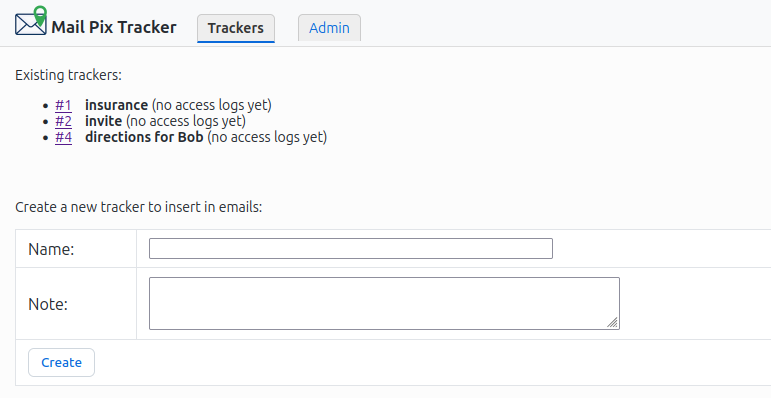
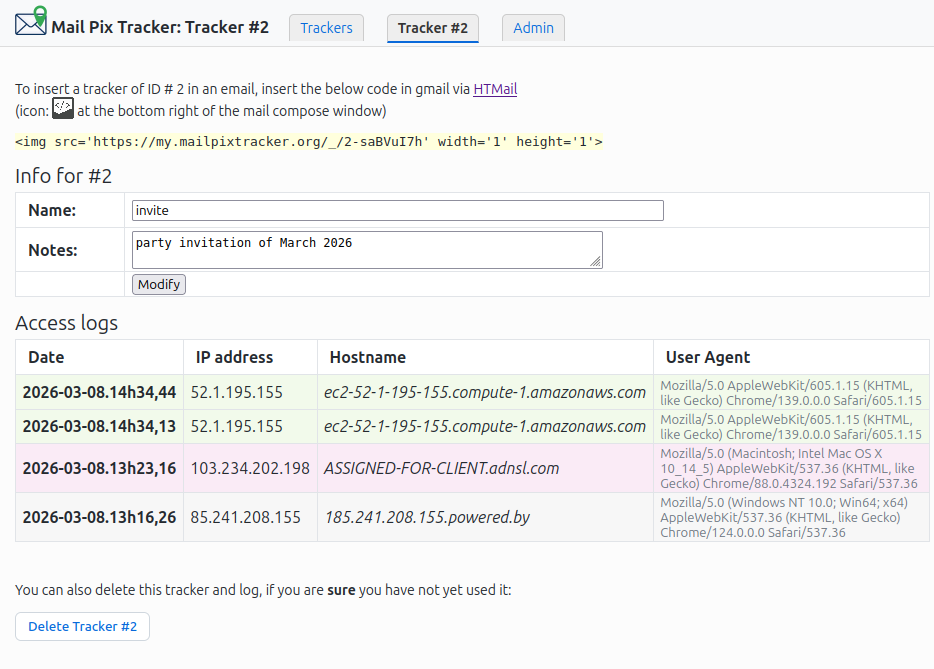
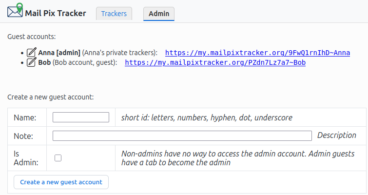

# Mail Pix Tracker

Mailpixtracker is a lightweight, privacy-focused Bash CGI script designed to track email opens via an invisible 1x1 pixel. Think of [MailTracker](https://www.getmailtracker.com/) or [MailTrack](https://mailtrack.email/) or [MailSuite](https://mailsuite.com/), but for basic personal use, without all the marketing tools.

- Just three shell scripts: `mailpixtracker` and `tracker` here, and  [cgibashopts](https://github.com/ColasNahaboo/cgibashopts)
- Only needs any web server able to execute [CGI](https://en.wikipedia.org/wiki/Common_Gateway_Interface) scripts
- It generates for you a simple HTML line to include in your emails
- Simple security via [Capability URLs](https://www.w3.org/TR/capability-urls/) intead of accounts with logins and passwords
- Data is kept as plain files, no databases
- It is privately self-hosted: everything is on your own server, nothing is handled by a third party.
- The main account can create guests accounts — by just giving them a link — that can use the system without being able to use or see the files of other accounts. Guests do not have a way to find the main admin account, unless specifically declared admins

Note that the tracking is not foolproof. Most mailers nowadays prompt the user before loading images. So people could have read your emails without triggering the tracker.

## Prerequisites

* **Web Server**: Apache or any web server with CGI support
* **Linux system with GNU utilities**: Debian, Ubuntu, ... systems where `date --version` shows "GNU". Bash must be at least version 4.2.
* **cgibashopts**: A file that must be copied in the same directory as mailpixtracker. Get it from here: [cgibashopts](https://github.com/ColasNahaboo/cgibashopts/blob/main/cgibashopts)

## Usage Summary
- Go to the script URL on your web server.<br>E.g: `https://my.mailpixtracker.org/gZu2SpMbpJ`
- Create a new tracker. You will need one separate tracker (with a unique ID number) for each email, to track each email in a separate log. You can optionally add a meaningful name.
- Mailpixtracker will then show you the log page for the tracker. You can edit its name and various notes at any time.
- When composing your email, copy/paste into it the yellow highlighted HTML line at the top of the log page, via your installed browser extension or email software.
- Note that the log will begin to fill up while composing your mail once the tracker is installed. The first lines in the log - yours - are always highlighted in grey, to differentiate them from recipients.
- Once the email is sent, each time people will read it, and have allowed their mailers to display images, the mailtracker log page will add an entry.
- Log entries are colored with a different color for each client IP address, for ease of reading.
- New log entries added since last time the log was viewed have a yellow rectangle at their left side.
- The Notes field is a convenient way to store details about the sent email for this tracker ID, as well as remembering which timestamps correspond to specific events. Use it!

### Guest accounts

- The admin account can create new trackers, manage guest accounts, and view all system logs. But by default he only sees his onw trackers, to avoid confusion. To manage guest trackers, he must go to a guest account via the "Amdin" tab.
- Admin can create Guest accounts. Guests access a restricted dashboard via a unique URL: `https://my.mailpixtracker.org/guestpassword~guestname`
  The guest password is randomly generated and assigned, but the admin can choose meaningful guest names.
- The admin then just communicate to the guest his URL, and by using it he cannot get to the admin account, except if the account was created with the "admin" option set, in which case the guest will have an "admin" tab linking to the admin account
- Non-admin guests can only see and manage trackers they have created.

## Example

The main Admin UI. It lists the created trackers (but no the ones of the guests), and allow to create new ones.



Logs of one tracker (more recent first). Each IP adress has an unique color. Your own adress (used when composing the email) is always in dim grey. You can change the tracker name and description, and delete it.



Admin panel, listing the guest accounts and enabling creating one.



## Installation & Directory Structure

First, you need to decide on an admin password: a random alphanumeric string that will be the installed name of the script and should not be guessable. You can you run `doc/random-string.sh` to get suggestions. In the rest of this doc, we will use `gZu2SpMbpJ`

Mailpixtracker expects the following layout. The `cgi` folder should be your web-visible directory (e.g., `DocumentRoot`), while `data` and the configuration file stay one level above (protected).

```text
/www/mpt/
├── data/                 # Writable by www-data (logs and metadata)
├── mailpixtracker.conf   # Global configuration (optional)
└── cgi/                  # The Web Root
    ├── gZu2SpMbpJ        # mailpixtracker, but renamed as your admin "password"
    ├── _                 # tracker script, renamed as underscore
    └── cgibashopts       # bash library used by mailpixtracker

```

The `data` directory must be writable by the web server user:

```bash
# as root:
mkdir -p /www/mpt/{cgi,data}
chown -R www-data:www-data /www/mpt/

```

See an example of an Apache VirtualHost configuration: [doc/apache-sample.conf](doc/apache-sample.conf). If you use another server, just ask your favorite AI to translate this configuration file for your specific server.
Note how you can redirect in it `https://my.mailpixtracker.org/` to the admin account form some IP adresses you consider secure, so that admins do not have to remember/store the admin password.

**Configuration**: Not much, but you can customize your setup in `../mailpixtracker.conf`. You can redefine variables like `passlen` or execute any bash code of your choice

```bash
# Example mailpixtracker.conf
passlen=12

```

- Copy the bash scripts `mailpixtracker` and `tracker` into the `/www/mpt/cgi` directory on your web server, and also the [cgibashopts](https://github.com/ColasNahaboo/cgibashopts) script
- Rename there `mailpixtracker` as your admin password, e.g. `gZu2SpMbpJ`
- Rename `tracker` as `_`
- If using a webmail, I recommend installing a browser extension to allow easy inclusion of the generated tracker HTML code in your emails. For GMail, you can use the HTMail extension for [Firefox](https://addons.mozilla.org/en-US/firefox/addon/htmail/) or [Chrome](https://chromewebstore.google.com/detail/htmail-insert-html-into-g/omojcahabhafmagldeheegggbakefhlh?hl=en).

### Data structure and Implementation

```text
/www/mpt/
├── mailpixtracker.conf     # Global configuration (optional)
├── cgi/                    # The Web Root
│   ├── gZu2SpMbpJ          # mailpixtracker, renamed as your admin "password"
│   ├── _                   # tracker script, renamed as underscore
│   ├── cgibashopts         # bash library used by mailpixtracker
│   ├── 9FwQ1rnIhD~Anna     # symlink to gZu2SpMbpJ. Anna's guest account
│   └── PZdn7Lz7a7~Bob      # symlink to gZu2SpMbpJ. Bob's guest account
└── data/                   # Writable by www-data (logs and metadata)
    ├── trash/              # "deleted" trackers and accounts are moved there
    ├── 12~I5rHJCFap.log    # access logs for tracker #12
    ├── 12~I5rHJCFap.meta   # metadata (name, note, ...) for tracker #12
    ├── ~Anna/              # account and trackers info for Anna
    │   ├── meta            # metadata of the Anna account (notes, is-admin)
    │   ├── 3~ciyImp7C.log  # access logs for tracker #3 of Anna
    │   ├── 3~ciyImp7C.meta # metadata for tracker #3 of Anna
    └── ~Bob/               # account and trackers info for Bob

```

Metadata — bash Associatrive Arrays — are stored in "bash native" format via `declare -p` via the embedded functions of `metadata.sh` of my collection of bash snippets [colas-bash-lib](https://github.com/ColasNahaboo/colas-bash-lib)

Logs are lines of 4 tab-separated values: date, ip-adress, adress-name, user-agent.

## License

This project is **multi-licensed**. You are free to redistribute it and/or modify it under the terms of **any one** of the following licenses of **your choice**:

- **[MIT](https://opensource.org/licenses/MIT):** The simplest, most permissive option. Just keep the copyright notice.

- **[Apache 2.0](https://www.apache.org/licenses/LICENSE-2.0):** Permissive like MIT, but includes explicit protection against patent litigation.

- **[MPL 2.0](https://www.mozilla.org/en-US/MPL/2.0/):** The "middle ground." If you modify files in this project, you must share those specific changes, but you can keep the rest of your project private.

- **[LGPL v3](https://www.gnu.org/licenses/lgpl-3.0.html):** Allows you to link this code into a private project without opening your own code, as long as the user can still replace this library with their own version.

- **[GPL v3](https://www.gnu.org/licenses/gpl-3.0.html):** The "Strong Copyleft" option. If you use this code in a project you distribute, your entire project must also be open source.

**Which one should I use?** If you aren't sure, the **MIT** license is the most flexible for most users. If you are integrating this into an existing open-source project, choose the license that matches that project's existing terms.

If you would like to use another open-source license instead, please contact me.

(c) 2025 Colas Nahaboo, https://colas.nahaboo.net

## History

- v3.0.3 2026-03-25 "copy icon" button to copy the HTML to include in the mail
- v3.0.2 2026-03-14
  - switched to a multi-license
  - small usability change: in the main "trackers" view, show the tracker creation form first, and then list the existing trackers most recent first.
- v3.0.1 2026-02-10 minor bug fixes
- v3.0.0 2026-03-09 Version 3 introduces:
  - a robust multi-user (Guest) system
  - a cleaner, more modern UI
  - code refactoring, and data reorganisation for a cleaner separation between the web-accessible scripts and private tracking data
  - consistent security via unguessable [Capability URLs](https://www.w3.org/TR/capability-urls/)
  - a separate minimal tracker script for the actual pixel logging
  - Warning: v3 is **incompatible** with v2, an installation from scratch is recommended 
- v2.2.2 2025-12-07 IP adress index number shown in left column of logs
- v2.2.1 2025-11-27 optional global mpt.conf for all names, env var MAILPIXTRACKER_GLOBALCONF
- v2.2.0 2025-11-25 new log entries signaled.
- v2.1.1 2025-11-25 UI display now "#NN" instead of "for NN"
- v2.1.0 2025-11-25 smaller htmail icon, can edit name and note metadata
- v2.0.0 2025-11-24
  - log lines format change: tab-separated values
  - v2 only logs in the v2 format, but can read the v1 format.
  - metadata for the log files
  - tabular output of the log lines for better readability
  - no more mailpixtracker-n file
  - now requires cgibashopts
  - on tracker creation, a name can be given to the tracker
- v1.0.4 2025-11-21 log lines have one color per distinct IP. First one is always grey.
- v1.0.3 2025-11-21 $MAILPIXELTRACKER_CONF env var to define config file location. Default footer identifying the script.
- v1.0.2 2025-11-16 autocreate `$dir` if needed.
- v1.0.0 2025-11-16 Initial released version.
